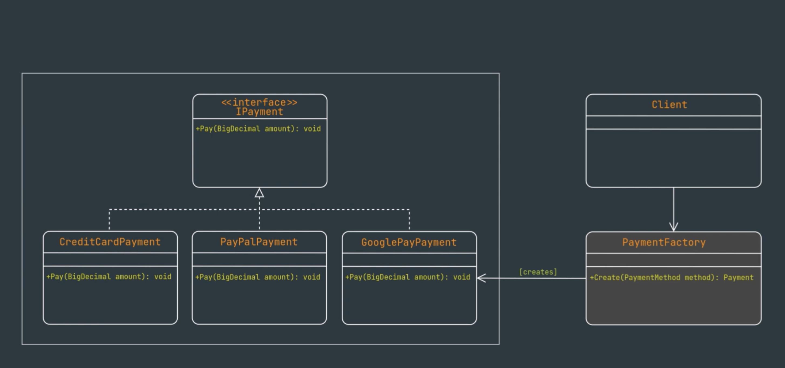

# Factory Method Pattern

## Introduction

Factory Method Pattern is a **creational design pattern** that simplifies object creation by encapsulating the logic and decoupling it from the client code.

**Key Points:**
- Encapsulates object creation logic in a centralized factory class
- Decouples client code from concrete implementations
- Provides a centralized point of control for object creation
- Promotes the open/close principle - allows new subclasses without modifying existing code
- Enables easier testing and mocking of client code

**Common Examples:**
- Payment processing systems
- Database connection factories
- UI component creation
- Logger factories
- Document parsers

---

## UML Diagram



The diagram shows how a `Client` interacts with a `PaymentFactory` to create different types of payment objects (Credit Card, PayPal, Google Pay) that all implement the `IPayment` interface, without the client needing to know the concrete implementation details.

---

## Video Tutorial

Watch this video for a detailed implementation walkthrough:

[Factory Pattern Implementation in C#](https://youtu.be/SLEu6rNdJj0?si=iDW3pgvH6rb_g6fm)

---

## Basic Implementation

The Factory Method Pattern uses a factory class to create objects instead of directly instantiating them. The client code doesn't need to know which concrete class is being created.

### Step-by-Step Implementation

Let's implement the Factory Pattern using a payment processing example:

#### Step 1: Create the Interface (Abstract Product)

```csharp
interface IPayment {
    void Pay(BigDecimal amount);
}
```

#### Step 2: Create Concrete Implementations (Concrete Products)

```csharp
class CreditCardPayment : IPayment {
    public void Pay(BigDecimal amount) {
        // Credit card payment logic
        Console.WriteLine($"Processing credit card payment of {amount}");
    }
}

class PayPalPayment : IPayment {
    public void Pay(BigDecimal amount) {
        // PayPal payment logic
        Console.WriteLine($"Processing PayPal payment of {amount}");
    }
}

class GooglePayPayment : IPayment {
    public void Pay(BigDecimal amount) {
        // Google Pay payment logic
        Console.WriteLine($"Processing Google Pay payment of {amount}");
    }
}
```

#### Step 3: Create the Factory Class

```csharp
enum PaymentMethod {
    CreditCard,
    PayPal,
    GooglePay
}

class PaymentFactory {
    public static IPayment Create(PaymentMethod method) {
        switch (method) {
            case PaymentMethod.CreditCard:
                return new CreditCardPayment();
            case PaymentMethod.PayPal:
                return new PayPalPayment();
            case PaymentMethod.GooglePay:
                return new GooglePayPayment();
            default:
                throw new ArgumentException("Invalid payment method");
        }
    }
}
```

#### Step 4: Client Usage

```csharp
// Client code - doesn't need to know about concrete classes
var payment1 = PaymentFactory.Create(PaymentMethod.CreditCard);
payment1.Pay(100.00m);

var payment2 = PaymentFactory.Create(PaymentMethod.PayPal);
payment2.Pay(200.00m);

var payment3 = PaymentFactory.Create(PaymentMethod.GooglePay);
payment3.Pay(300.00m);
```

---

## Without Factory Pattern vs With Factory Pattern

### Without Factory Pattern ❌

**Problem:** Client code is tightly coupled to concrete classes.

```csharp
// Client needs to know about all concrete classes
IPayment payment;

if (paymentType == "CreditCard") {
    payment = new CreditCardPayment();
} else if (paymentType == "PayPal") {
    payment = new PayPalPayment();
} else if (paymentType == "GooglePay") {
    payment = new GooglePayPayment();
}

payment.Pay(100.00m);
```

**Problems:**
- ❌ Client code is tightly coupled to concrete payment classes
- ❌ Adding a new payment method requires modifying client code
- ❌ Violates open/close principle
- ❌ Hard to test (can't easily mock)
- ❌ Logic scattered across multiple places

### With Factory Pattern ✅

**Solution:** Factory encapsulates the creation logic.

```csharp
// Client code - clean and simple
var payment = PaymentFactory.Create(PaymentMethod.CreditCard);
payment.Pay(100.00m);
```

**Benefits:**
- ✅ Client code is decoupled from concrete implementations
- ✅ Adding new payment methods doesn't require changing client code
- ✅ Follows open/close principle
- ✅ Easy to test and mock
- ✅ Centralized creation logic

---

## Key Benefits

### 1. Encapsulation and Reduced Coupling

The Factory Pattern encapsulates object creation logic, reducing coupling between the client and concrete classes. The client only depends on the interface, not the concrete implementations.

### 2. Centralized Point of Control

All object creation happens in one place (the factory), making it easier to manage and maintain. If you need to change how objects are created, you only modify the factory.

### 3. Open/Close Principle

The pattern promotes the open/close principle - open for extension, closed for modification. You can add new payment methods without modifying existing code.

**Example:**
```csharp
// Adding Apple Pay - just add new class and update factory
class ApplePayPayment : IPayment {
    public void Pay(BigDecimal amount) {
        Console.WriteLine($"Processing Apple Pay payment of {amount}");
    }
}

// Update factory
class PaymentFactory {
    public static IPayment Create(PaymentMethod method) {
        switch (method) {
            case PaymentMethod.CreditCard:
                return new CreditCardPayment();
            case PaymentMethod.PayPal:
                return new PayPalPayment();
            case PaymentMethod.GooglePay:
                return new GooglePayPayment();
            case PaymentMethod.ApplePay:  // New payment method
                return new ApplePayPayment();
            default:
                throw new ArgumentException("Invalid payment method");
        }
    }
}

// Client code remains unchanged! ✅
var payment = PaymentFactory.Create(PaymentMethod.ApplePay);
payment.Pay(100.00m);
```

### 4. Easier Testing and Mocking

Since the client depends on the interface, you can easily create mock objects for testing.

```csharp
// In tests, you can create a mock factory
class MockPaymentFactory {
    public static IPayment Create(PaymentMethod method) {
        return new MockPayment(); // Returns mock for testing
    }
}
```

---

## Complete Example

Here's a complete working example of the Factory Pattern:

```csharp
using System;

// Step 1: Interface
interface IPayment {
    void Pay(decimal amount);
}

// Step 2: Concrete Implementations
class CreditCardPayment : IPayment {
    public void Pay(decimal amount) {
        Console.WriteLine($"Processing credit card payment of ${amount}");
    }
}

class PayPalPayment : IPayment {
    public void Pay(decimal amount) {
        Console.WriteLine($"Processing PayPal payment of ${amount}");
    }
}

class GooglePayPayment : IPayment {
    public void Pay(decimal amount) {
        Console.WriteLine($"Processing Google Pay payment of ${amount}");
    }
}

// Step 3: Factory
enum PaymentMethod {
    CreditCard,
    PayPal,
    GooglePay
}

class PaymentFactory {
    public static IPayment Create(PaymentMethod method) {
        switch (method) {
            case PaymentMethod.CreditCard:
                return new CreditCardPayment();
            case PaymentMethod.PayPal:
                return new PayPalPayment();
            case PaymentMethod.GooglePay:
                return new GooglePayPayment();
            default:
                throw new ArgumentException("Invalid payment method");
        }
    }
}

// Step 4: Client Code
class Program {
    static void Main() {
        // Client code remains consistent regardless of payment method
        var payment1 = PaymentFactory.Create(PaymentMethod.CreditCard);
        payment1.Pay(100.00m);
        
        var payment2 = PaymentFactory.Create(PaymentMethod.PayPal);
        payment2.Pay(200.00m);
        
        var payment3 = PaymentFactory.Create(PaymentMethod.GooglePay);
        payment3.Pay(300.00m);
    }
}
```

**Output:**
```
Processing credit card payment of $100.00
Processing PayPal payment of $200.00
Processing Google Pay payment of $300.00
```

---

## Adding New Payment Methods

One of the key benefits of the Factory Pattern is how easy it is to extend. Let's add Apple Pay support:

### Step 1: Add New Concrete Class

```csharp
class ApplePayPayment : IPayment {
    public void Pay(decimal amount) {
        Console.WriteLine($"Processing Apple Pay payment of ${amount}");
    }
}
```

### Step 2: Update Enum

```csharp
enum PaymentMethod {
    CreditCard,
    PayPal,
    GooglePay,
    ApplePay  // New payment method
}
```

### Step 3: Update Factory

```csharp
class PaymentFactory {
    public static IPayment Create(PaymentMethod method) {
        switch (method) {
            case PaymentMethod.CreditCard:
                return new CreditCardPayment();
            case PaymentMethod.PayPal:
                return new PayPalPayment();
            case PaymentMethod.GooglePay:
                return new GooglePayPayment();
            case PaymentMethod.ApplePay:  // New case
                return new ApplePayPayment();
            default:
                throw new ArgumentException("Invalid payment method");
        }
    }
}
```

### Step 4: Use It

```csharp
// Client code works immediately - no changes needed!
var payment = PaymentFactory.Create(PaymentMethod.ApplePay);
payment.Pay(150.00m);
```

**Key Point:** The client code doesn't need to change when adding new payment methods. This demonstrates the open/close principle in action!

---

## Real Life Examples

### 1. Database Connection Factory

Different database types (SQL Server, MySQL, PostgreSQL) can be created using a factory.

```csharp
interface IDatabaseConnection {
    void Connect();
    void ExecuteQuery(string query);
}

class SqlServerConnection : IDatabaseConnection {
    public void Connect() {
        Console.WriteLine("Connecting to SQL Server");
    }
    public void ExecuteQuery(string query) {
        Console.WriteLine($"Executing SQL Server query: {query}");
    }
}

class MySqlConnection : IDatabaseConnection {
    public void Connect() {
        Console.WriteLine("Connecting to MySQL");
    }
    public void ExecuteQuery(string query) {
        Console.WriteLine($"Executing MySQL query: {query}");
    }
}

enum DatabaseType {
    SqlServer,
    MySql
}

class DatabaseFactory {
    public static IDatabaseConnection Create(DatabaseType type) {
        switch (type) {
            case DatabaseType.SqlServer:
                return new SqlServerConnection();
            case DatabaseType.MySql:
                return new MySqlConnection();
            default:
                throw new ArgumentException("Invalid database type");
        }
    }
}
```

### 2. Logger Factory

Different loggers (File, Console, Database) can be created using a factory.

```csharp
interface ILogger {
    void Log(string message);
}

class FileLogger : ILogger {
    public void Log(string message) {
        Console.WriteLine($"File Logger: {message}");
    }
}

class ConsoleLogger : ILogger {
    public void Log(string message) {
        Console.WriteLine($"Console Logger: {message}");
    }
}

enum LoggerType {
    File,
    Console
}

class LoggerFactory {
    public static ILogger Create(LoggerType type) {
        switch (type) {
            case LoggerType.File:
                return new FileLogger();
            case LoggerType.Console:
                return new ConsoleLogger();
            default:
                throw new ArgumentException("Invalid logger type");
        }
    }
}
```

### 3. Document Parser Factory

Different document parsers (PDF, Word, Excel) can be created using a factory.

```csharp
interface IDocumentParser {
    void Parse(string filePath);
}

class PdfParser : IDocumentParser {
    public void Parse(string filePath) {
        Console.WriteLine($"Parsing PDF: {filePath}");
    }
}

class WordParser : IDocumentParser {
    public void Parse(string filePath) {
        Console.WriteLine($"Parsing Word document: {filePath}");
    }
}

enum DocumentType {
    Pdf,
    Word
}

class DocumentParserFactory {
    public static IDocumentParser Create(DocumentType type) {
        switch (type) {
            case DocumentType.Pdf:
                return new PdfParser();
            case DocumentType.Word:
                return new WordParser();
            default:
                throw new ArgumentException("Invalid document type");
        }
    }
}
```

---

## Summary

### Key Points

- ✅ Factory Method Pattern is a **creational design pattern**
- ✅ **Encapsulates object creation** logic in a centralized factory class
- ✅ **Decouples client code** from concrete implementations
- ✅ Provides a **centralized point of control** for object creation
- ✅ Promotes **open/close principle** - easy to extend without modifying existing code
- ✅ Enables **easier testing and mocking** of client code

### Pattern Structure

1. **Interface (IPayment)** - Defines the contract for all products
2. **Concrete Classes (CreditCardPayment, PayPalPayment, etc.)** - Implement the interface
3. **Factory Class (PaymentFactory)** - Creates and returns appropriate instances
4. **Client** - Uses the factory to get instances without knowing concrete classes

### When to Use

- When you need to create objects but don't want to couple your code to specific classes
- When object creation logic is complex or scattered
- When you want to easily add new types without modifying existing code
- When you need centralized control over object creation
- When you want to make your code more testable

### Benefits

- ✅ **Reduced coupling** - Client depends on interface, not concrete classes
- ✅ **Easy to extend** - Add new types without changing client code
- ✅ **Centralized logic** - All creation logic in one place
- ✅ **Better testability** - Easy to mock and test
- ✅ **Follows SOLID principles** - Especially open/close principle

---

**Remember:** The Factory Pattern is all about **decoupling** object creation from object usage. The client code doesn't need to know which concrete class is being created - it just asks the factory for an object that implements the interface, and the factory handles the rest!
